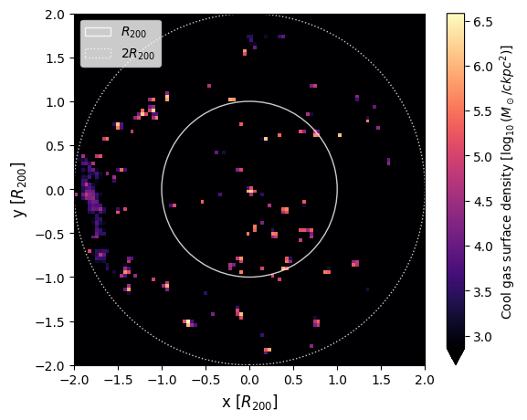

# Cool gas in galaxy clusters in TNG-Cluster

 

This repository hosts the code for the master thesis of Milan Staffehl and the subsequent paper by Staffehl et al. (2025) _The abundance and origin of cool gas in galaxy clusters in the TNG-Cluster simulation_ [[arxiv](https://arxiv.org/abs/2503.01960) | [ADS](https://ui.adsabs.harvard.edu/abs/2025arXiv250301960S/abstract)].

|  |
| :----------------------------------------------------------: |
| Distribution of cool ($T \leq 10^{4.5}\,\rm K$) gas in one of the simulated clusters of TNG-Cluster (zoom-in region 7, halo ID 1431487). Only gas within twice the virial radius is shown. The projection depth is one virial radius. |

------

Paper abstract:

> In addition to the hot intracluster medium, massive galaxy clusters host complex, multi-phase gaseous halos. In this work, we quantify the abundance, spatial distribution, and origin of the cool ($T\leq10^{4.5}\,\rm{K}$) gas within clusters. To do so, we combine the TNG-Cluster and TNG300 cosmological magnetohydrodynamical simulations, yielding a sample of 632 simulated galaxy clusters at $z=0$ with masses $M_{200c} \sim 10^{14-15.4}\,\rm{M_\odot}$. We find that cool gas is present in every cluster at $z=0$, although it constitutes only a small fraction of the total gas mass within twice the virial radius, ranging from $\sim 10^{-4}$ to a few per cent. The majority of cool gas resides in the cluster outskirts in infalling satellites and other halos. More rarely, cool gas can also be present in the central regions of clusters. More massive halos contain larger amounts (but not fractions) of cool gas ($\sim 10^{10-12}\,\rm{M_\odot}$), and we identify correlations between cluster cool gas fraction and several global halo and galaxy properties at fixed halo mass. Using Monte-Carlo Lagrangian tracer particles, we then track the origin of cool gas in present-day clusters. We find that the primary source is recent accretion at $z \lesssim 0.1$, predominantly in the form of pre-cooled gas carried by infalling satellite galaxies and other halos. However, in-situ cooling of the hot intracluster medium gas accreted at earlier epochs also contributes, especially in present-day cool-core clusters.

------

## Table of contents

- [Where do I find...?](#where-do-i-find)
- [Prerequisites](#prerequisites)
- [First steps](#first-steps)
  
- [Configuration](#configuration)
- [Running the code](#running-the-code)
- [Data generation](#data-generation)
- [Recreating figures](#recreating-figures)
- [Repository structure](#repository-structure)
  
- [Development](#development)
- [License](#license)

## Where do I find...?

Looking for something in particular? Here is a list of common things you might be looking for and where to find them:

- **Commands to recreate figures:** There is a dedicated section for [recreating plots](#recreating-figures) from the paper.
- **Explanation what each script does:** Use the `--help` command of the scripts to learn what they do. See also the [scripts](#scripts) section of this README.
- **That one script that makes this one plot I need:** Look into the scripts and find the topic that best describes what you are looking for. Consult also the [scripts](#scripts) section of this README for hints. Then use the `--help` command on the scripts to find the one you are looking for. 
- **Helpful code to handle TNG simulation data:** For loading data directly from TNG simulations, look at the `library.data_acquisition` package in the `src` directory. For visualization, the `library.plotting` package is the best starting point, especially the `common` module. If you look for a more general-purpose and optimized solution, check out [`scida`](https://github.com/cbyrohl/scida).
- **Data documentation:** For some [topics](#topics), the `library.loading` modules act as make-shift documentation, offering an interface for working with data derived from this code. For the cool gas history hdf5 archive, a [separate README](./docs/CGH_README.md) exists in this project. 
- **The finished plots after running a script:** The finished plots are placed in the figures home directory you specify in the `config.yaml` of the project (see section [configuration](#configuration)). In there, it is under the same topic as the script that generated it. You might have to navigate further subdirectories to find it, though. If your figures home is set to "default", the figures are located in the project directory under `/figures`.
- **The paper/the master thesis:** The paper is available on [arxiv](https://arxiv.org/abs/2503.01960) and [ADS](https://ui.adsabs.harvard.edu/abs/2025arXiv250301960S/abstract). The master thesis can be made available upon reasonable request.

## Prerequisites

The code in this repository requires Python 3.10 or higher to run. Additionally, to create figures, the simulation data of at least the [TNG300](https://www.tng-project.org/data/downloads/TNG300-1/) simulation and the [TNG-Cluster](https://www.tng-project.org/data/downloads/TNG-Cluster/) simulation must be available. You can find them on the official IllustrisTNG [data release page](https://www.tng-project.org/data/). 

## First steps

To be able to use the code, you must follow these steps:

1. Create a config file
2. Install the `illustris_python` package
3. Install remaining requirements

The following sections guide you through the process.

### Create a config file

In order for the code to locate the simulation data, you must create a configuration file. You can do this one of two ways:

1. **Create config file manually:** Copy the content of the file from below into a new file named `config.yaml` and place it at the project root directory (i.e. where this README is located).

   ```YAML
   paths:
     base_paths:
       TNG300-1: /virgotng/universe/IllustrisTNG/TNG300-1/output
       TNG50-4: /virgotng/universe/IllustrisTNG/TNG50-4/output
       TNG50-3: /virgotng/universe/IllustrisTNG/TNG50-3/output
       TNG-Cluster: /virgotng/mpia/TNG-Cluster/TNG-Cluster/output
     data_home: default
     figures_home: default
     cool_gas_history_archive:
       TNG300-1: default
       TNG-Cluster: default
   ```

2. **Run the install script:** The install script has no requirements and creates the config file automatically for you. Simply run the following command with Python 3.10+ from the project root:

   ```bash
   python install.py
   ```
   

Once you have created the config file, replace the paths according to your environment. You can find a detailed description of the paths below in the section on [configuration](#configuration). 

>  [!TIP]
>
> If you manually create a config file, it is recommended to still run the installation script afterwards. This creates the directories for data and figures if they don't already exist, and an `/external` directory in the project directory, under which you can clone the `illustris_python` repository (see below). If you opt for the default directories, these will also be created accordingly. 

### Install `illustris_python`

The code relies on the [Illustris Python helper scripts](https://github.com/illustristng/illustris_python). You can install them by cloning the `illustris_python` repository anywhere on your machine and installing them. If you have run the installation script, a dedicated `external` directory in the project was created for this purpose. Installation inside of a clean venv, conda environment, or uv project is recommended. 

```bash
git clone git@github.com:illustristng/illustris_python.git
cd illustris_python
pip install .
```

### Install requirements

Finally install all remaining requirements from the project root and inside your dedicated Python environment:

```bash
python -m pip install -r requirements.txt
```

## Configuration

The configuration file allows you to specify the paths under which the simulation data is located, where generated data is stored, and where the final figures will be placed. The following is a description of all paths and what they do.

- `base_paths`: The base paths of the simulations. These must be mappings of the simulation name, including potential resolution suffix (e.g. TNG50-1 instead of just TNG50), to the base path of the simulation. The base path of a TNG simulation is typically the `output` directory, containing the `snapdir_XYZ` and `groupcat_XYZ` directories of the simulation. You can add additional TNG simulations if they are available to you.
- `data_home`: The directory where generated data files will be stored. Within the given directory, the code will place its own substructure of subdirectories. Whenever data is loaded from file, the code will query this location as well. When set to `default`, the data home directory will be placed at the project root in a subdirectory named `data`.
- `figures_home`: The directory where generated figures will be stored. As with the data home, the code will will create its own substructure in the given directory. When set to `default`, the figures home directory will be placed at the project root in a subdirectory named `figures`.
- `cool_gas_history_archive`: The code tracks the development of cool gas in clusters from redshift zero back to redshift eight. At every snapshot in between, it saves various data for all the traced particles in a hdf5 archive. This path specifies the location of this archive. Not that the archive file created will be relatively large (~57 GB).

> [!Tip]
>
> If you work on the VERA cluster, the default settings should work "out-of-the-box".

## Running the code

The code in this repository was written for execution on computational clusters. Most of it cannot be run on personal machines, both due to memory requirements and due to computation time. 

The code was written for execution on the VERA cluster of the Max Planck Institute for Astrophysics. As such, it may have certain things hard-coded that only work on the cluster. 

### Scripts

The code is executed using Python scripts located in the `scripts` directory of this project. Every script has a command-line interface and most scripts are highly customizable. Each script comes with an extensive help text that explains its exact purpose and lists the plots it can produce. To view the help text, use the `--help` or `-h` argument like so:

```bash
python <name_of_script>.py --help
```

### Topics

The scripts are divided into different topics. Each topic gathers code to create figures that are aimed at a similar question or a common goal. A topic can contain multiple scripts, and each script may generate multiple different figures. 

Below is a list of topics:

- `auxiliary`: Auxiliary scripts, most prominently a script to catalog particle indices and properties for all particles in clusters of TNG300-1.
- `gas_flow`: Velocity distribution of cool gas in clusters. 
- `images`: Images of the cool gas distribution in clusters (such as the example above).
- `mass_trends`: Trends of cool gas mass and cool gas mass fraction with halo mass, both across all halos of TNG300 and only clusters; correlation of cool gas mass and cool gas fraction with cluster properties.
- `merger_tree`: Diagnostic tools to examine and explore the merger trees of TNG300 and TNG-Cluster.
- `radial_profiles`: Radial density and temperature profiles of cool gas in clusters.
- `temperature_distributions`: Temperature distribution across all halos of TNG300-1.
- `tracer_history`: All scripts concerning the tracking of cool gas predecessors back to z = 8. This includes tracking properties of the eventual cool gas, exploration of its physical origin, and assembly history.

The `scripts` directory also contains a shell script to run all plotting jobs. However, this only works if all data has previously been generated and is available on file. Despite the name, it may also not plot _all_ possible figures. It is therefore recommended to always use the corresponding script directly. 

### slurm batch scripts

Many of the scripts in this project require significant computation time and resources. These scripts are accompanied by batch scripts that allow submitting them as slurm jobs on a cluster. These batch scripts are located inside a separate `batch` subdirectory of the corresponding topic. 

Since they are explicitly designed for the VERA cluster of the MPIA, you might have to adapt them to your requirements before using. 

## Data generation

In order to be able to generate figures, certain data needs to be generated first. This concerns primarily the identification of cool gas cells around z = 0 clusters in TNG300 and tracing back redshift zero cool gas using the Lagrangian Monte-Carlo tracer particles in TNG-Cluster. Both of these processes take considerable time and computational resources. Always run the corresponding batch jobs or submit the script for execution on your cluster of choice yourself. Even so, expect the process to take multiple hours.

> [!NOTE] 
>
> The examples below use the environment variable `N_PROCESSES` as a placeholder for the number of processes you wish to use. Replace it with the number of cores available to you, or with the `$SLURM_CPUS_PER_TASK` variable for execution with slurm.
>
> All commands show the full path to the script from the project root.

### Identifying cluster gas in TNG300

This step is required to identify all gas cells within $2R_{200c}$ of TNG300 clusters: 

```bash
python ./scripts/auxiliary/tabulate_cluster_data.py --processes $N_PROCESSES --force-tree
```

Corresponding batch script: `./scripts/auxiliary/batch/tabulateclusterdata.sh`

### Creating the cool gas history archive

All plotting jobs of the `tracer_history` topic require tracing back the origins of redshift zero cool gas and the tabulation of properties of the traced gas cells. The corresponding data will be saved in a hdf5 archive under the directory specified in your [config file](#configuration). 

> [!CAUTION]
>
> Recreating the archive file takes a considerable amount of time. Expect multiple hours, potentially days, for a full recreation run.

The following steps must be performed in the order listed in order to create the archive and populate it with the required data:

1. Identify tracers in redshift zero cool gas of TNG-Cluster clusters:

   ```bash
   python ./scripts/tracer_history/generate_tracer_data.py identify -s TNG-Cluster 
   ```

2. Trace back identified tracers. This command must be executed separately for every snapshot. Replace `<SNAP>` with the snapshot number you wish to process. 

   ```bash
   python ./scripts/tracer_history/generate_tracer_data.py trace-back -s TNG-Cluster -p $N_PROCESSES -n <SNAP>
   ```

   Corresponding batch script: `./scripts/tracer_history/batch/generate_tracer_data_all.sh`

3. Archive generated data and create the cool gas history hdf5 archive file:

   ```bash
   python ./scripts/tracer_history/generate_tracer_data.py archive -s TNG-Cluster --unlink
   ```

4. (Optional) Test archived data for completeness and validity:

   ```bash
   python ./scripts/tracer_history/generate_tracer_data.py test-archive -s TNG-Cluster
   ```

5. Tabulate distance, temperature, density, and mass of the traced particles:
   ```bash
   python ./scripts/tracer_history/plot_quantity_with_time.py distance -p $N_PROCESSES --unlink --force-overwrite --no-plots --to-file
   python ./scripts/tracer_history/plot_quantity_with_time.py temperature -p $N_PROCESSES --unlink --force-overwrite --no-plots --to-file
   python ./scripts/tracer_history/plot_quantity_with_time.py density -p $N_PROCESSES --unlink --force-overwrite --no-plots --to-file
   python ./scripts/tracer_history/plot_quantity_with_time.py mass -p $N_PROCESSES --unlink --force-overwrite --no-plots --to-file
   ```

   Corresponding batch scripts: `./scripts/tracer_history/batch/generate_particle_data_distance.sh`, `generate_particle_data_temperature.sh`, `generate_particle_data_density.sh`, and `generate_particle_data_mass.sh`.

6. Identify, for every traced particle, their parent halo and parent subhalo:
   ```bash
   python ./scripts/tracer_history/plot_quantity_with_time.py parent-halo -p $N_PROCESSES --unlink --force-overwrite --no-plots --to-file
   python ./scripts/tracer_history/plot_quantity_with_time.py parent-subhalo -p $N_PROCESSES --unlink --force-overwrite --no-plots --to-file
   ```

   Corresponding batch scripts: `./scripts/tracer_history/batch/generate_particle_data_parent_halo_index.sh` and `generate_particle_data_parent_subhalo_index.sh`.

7. Generate post-processing data (crossing times, cooling times, parent category):
   ```bash
   python ./scripts/tracer_history/generate_postprocessed_particle_data.py crossing-times
   python ./scripts/tracer_history/generate_postprocessed_particle_data.py crossing-times-1rvir
   python ./scripts/tracer_history/generate_postprocessed_particle_data.py cooling-times
   python ./scripts/tracer_history/generate_postprocessed_particle_data.py parent-category
   ```

8. (Optional) Test archived data. This requires `pytest` to be installed.
   ```bash
   pytest ./scripts/tracer_history/tests/test_archived_data.py
   ```

## Recreating figures

Below is a list of commands to fully recreate all figures of Staffehl et al. (2025), provided the corresponding data has been generated previously. 

Alongside the Python command to run the script, the slurm job submission batch scripts are provided. They are always located in the directory of the script in a `batch` subdirectory. Not every script requires execution on clusters, so not every command is accompanied by a batch script.

> [!TIP]
>
> If you have created a figure previously and just wish to re-plot it with the same data (for example because you made visual changes), use the `--load-data` argument of the script instead of the `--to-file` argument to skip re-generating the plot data and instead load existing data from file. When using the `--load-data` option, no execution on clusters is required.

- **Fig. 1:** Gas mass and gas fraction vs. halo mass. (batch script: `plotmasstrends.sh`)

  ```bash
  python ./scripts/mass_trends/plot_mass_trends.py -s TNG300-1 -p $N_PROCESSES --to-file
  ```

- **Fig. 2:** Temperature distribution across halos of TNG300. (batch script: `plothistfrac.sh`)

  ```bash
  python ./scripts/temperature_distributions/plot_temperature_distribution.py -s TNG300-1 -p $N_PROCESSES --to-file -c -d
  ```

- **Fig. 3:** Figure 3 cannot be recreated with the code of this repository.

- **Fig. 4:** Cool gas mass and gas fraction vs. cluster mass, correlation with cluster properties. (batch script: `plotcoolgasclustertrend.sh`)

  ```bash
  python ./scripts/mass_trends/plot_extended_cool_gas_mass_trends.py --to-file --field sfr -fr
  python ./scripts/mass_trends/plot_all_mass_trends.py --no-plots
  python ./scripts/mass_trends/plot_statistical_measures.py -w pcc
  ```

- **Fig. 5:** Correlation of cool gas fraction in innermost 5% of virial radius with cluster properties.

  ```bash
  python ./scripts/mass_trends/plot_statistical_measures.py -w pcc -cc
  ```

- **Fig. 6:** Radial temperature profile of clusters. (batch scripts: `no_tree/TNG300_1/individual_temperature.sh`, `no_tree/TNG_Cluster/individual_temperature.sh`)

  ```bash
  python ./scripts/radial_profiles/plot_individual_radial_profiles.py -s TNG300-1 -p $N_PROCESSES -w temperature --to-file -x -t
  python ./scripts/radial_profiles/plot_individual_radial_profiles.py -s TNG-Cluster -p $N_PROCESSES -w temperature --to-file -x -t
  python ./scripts/radial_profiles/stackbin_radial_profiles.py -w temperature -m mean --log
  ```

  If you get an error about construction of a KDTree being required, either drop the `-t` option, or create the missing particle data by following the instructions in the corresponding [data generation section](#identifying-cluster-gas-in-tng300). If you opt for dropping the `-t` option, you can use the batch scripts located under the `with_tree` directory.

- **Fig. 7:** Radial temperature profile of clusters, center only. (batch scripts: `no_tree/TNG300_1/individual_temperature_core.sh`, `no_tree/TNG_Cluster/individual_temperature_core.sh`)

  ```bash
  python ./scripts/radial_profiles/plot_individual_radial_profiles.py -s TNG300-1 -p $N_PROCESSES -w temperature --to-file -cc -x -t
  python ./scripts/radial_profiles/plot_individual_radial_profiles.py -s TNG-Cluster -p $N_PROCESSES -w temperature --to-file -cc -x -t
  python ./scripts/radial_profiles/stackbin_radial_profiles.py -w temperature -m mean --log -cc
  ```

- **Fig. 8:** Radial density profiles of cool gas. (batch scripts: `no_tree/TNG300_1/individual_density.sh`, `no_tree/TNG_Cluster/individual_density.sh`, `no_tree/TNG300_1/individual_density_core.sh`, `no_tree/TNG_Cluster/individual_density_core.sh`)

  ```bash
  # Top panel
  python ./scripts/radial_profiles/plot_individual_radial_profiles.py -s TNG300-1 -p $N_PROCESSES -w density --to-file -x -t
  python ./scripts/radial_profiles/plot_individual_radial_profiles.py -s TNG-Cluster -p $N_PROCESSES -w density --to-file -x -t
  python ./scripts/radial_profiles/stackbin_radial_profiles.py -w density --log --combined
  # Bottom left panel
  python ./scripts/radial_profiles/plot_individual_radial_profiles.py -s TNG300-1 -p $N_PROCESSES -w density --to-file -x -t -cc
  python ./scripts/radial_profiles/plot_individual_radial_profiles.py -s TNG-Cluster -p $N_PROCESSES -w density --to-file -x -t -cc
  python ./scripts/radial_profiles/stackbin_radial_profiles.py -w density --log --combined -cc
  # Bottom right panel
  python ./scripts/radial_profiles/plot_density_profiles_split_by_velocity.py -r cool --vmax 0.1 --log -uv
  ```

- **Fig. 9:** Velocity distribution of cool gas. 

  ```bash
  python ./scripts/gas_flow/plot_velocity_distribution.py --regime cool --log --to-file
  ```

- **Fig. 10:** Evolution of spatial distribution of traced particles.

  ```bash
  python ./scripts/tracer_history/plot_final_figures.py tracer-fraction
  python ./scripts/tracer_history/plot_crossing_time_plots.py crossing-times -pt 0,6
  python ./scripts/tracer_history/plot_quantity_with_time.py distance --load-data -pt 1
  ```

  These commands and all following ones assume the cool gas history archive has been created as described [above](#creating-the-cool-gas-history-archive).

- **Fig. 11:** Cooling time plots.

  ```bash
  python ./scripts/tracer_history/plot_crossing_time_plots.py cooling-times -pt 0,6
  ```

- **Fig. 12:** Temperature evolution of traced particles.

  ```bash
  python ./scripts/tracer_history/plot_quantity_with_time.py temperature --load-data -pt 0,1
  ```

- **Fig. 13:** Evolution of parent category of tracers.

  ```bash
  python ./scripts/tracer_history/plot_parent_category_plots.py -pt 0
  ```

- **Fig. 14:** Temperature evolution, split by parent category of the tracers.

  ```bash
  python ./scripts/tracer_history/plot_quantity_with_time.py temperature --load-data -pt 1 --split-by reduced-parent-category
  ```

- **Fig. 15:** Origin of cool gas by host structure.

  ```bash
  python ./scripts/tracer_history/plot_final_figures.py bar-chart
  python ./scripts/tracer_history/plot_final_figures.py mass-plot --combine
  ```

## Repository structure

Below is an explanation of the structure of the code in this repository. Refer to it to more easily find what you need.

- `docs`: Data documentation files.

- `notebooks`: Jupyter notebooks, mostly containing diagnostic scripts and temporary test code.

- `scripts`: Scripts used to execute code and create figures. See section on [scripts](#scripts) for details. This directory is sorted by topic.

- `src`: The source directory contains all actual source code for the project. It is organized as a Python package and divided into two sub-packages.

  - `library`: The library package contains general-purpose code, re-usable functions, and most of the logic of the code. It is divided into sub-packages:

    - `config`: Set up configuration and environment, logging config.
    - `data_acquisition`: Helper functions for loading simulation data.
    - `loading`: Functions to load data previously created by the code of this project.
    - `plotting`: Plotting utilities and abstractions, using matplotlib.
    - `processing`: Functionality for data processing, such as statistics functions, parallelization utilities, etc.

    In addition to these sub-packages, there are five top-level modules in the library package:

    - `cgh_archive`: Helper functions for working with the cool gas history hdf5 archive.
    - `compute`: Functions to compute physical quantities, accelerated using numpy.
    - `constants`: Module for physical and simulation-related constants.
    - `scriptparse`: Helper functions for parsing script arguments and input.
    - `units`: Utilities for unit conversion.

  - `pipelines`: The pipeline package is divided into the same topics as the scripts. Pipelines themselves are classes that are constructed by the scripts according to the arguments received from the command line. They define a `run` method which strings together code to load and process data and create figures. Pipelines are derived from a common base class and offer a more or less convenient interface for working with the code.

Unit test suites exist for some of the library modules. Where they exist, they are placed in a `tests` subdirectory located at the directory of the module itself. Additionally, some of the pipelines are accompanied with test suites in the same way as well.

## Development

If you wish to work on the code yourself, you may find it beneficial to install the development requirements for the project:

```bash
pip install -r requirements-dev.txt
pre-commit install
```

This installs the pytest framework, dev tools, and especially `pre-commit`, which is already configured for the project.

## License

TBD